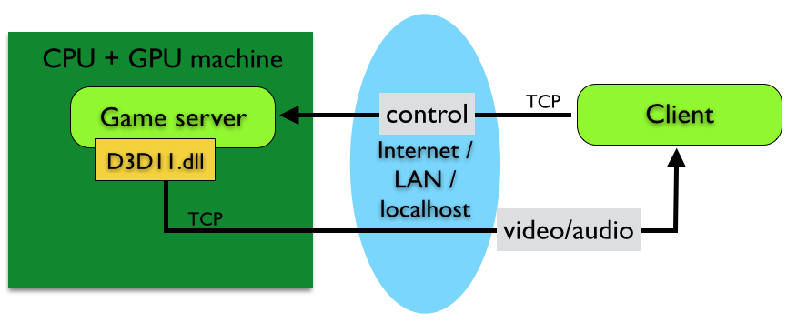

# CCDK Overview
The CCDK, or Community Cloud Development Kit, is designed to be a one-stop solution for developing a cloud game using Shinra technology.

Inside the github repository located at ( <a href="https://github.com/ShinraTech/CCDK">https://github.com/ShinraTech/CCDK</a> ) you’ll find the CCDK’s documentation, source code, sample code, and required binaries.

The CCDK is supported by Shinra Technologies via its official Facebook group and via GitHub. <a href="https://www.facebook.com/pages/Shinra-Community-CDK/1613401802228319">Facebookグループ</a> If you have any questions, issues, or comments, feel free to reach out to us here. We also provide support in English at <a href="mailto:ccdk-en@shinra.com">ccdk-en@shinra.com.</a> 

PLease familiarize yourself with the [FAQ](FAQ.en.md) find the answer to a number of frequently asked questions.


CCDK Cans and Can’ts
====
What you can do with the CCDK:


1. Game staging and test play: The CCDK is designed to support 1:1, 1:N, and N:N game architectures, with the ability to test locally and simulate a streaming game on the Shinra platform (including local video streaming and latency simulation). You can also test with a backend server. (1:N support is a work in progress as of April 2015.)

2. Shinra platform-ready: The CCDK can create a package that is ready to be deployed to a Shinra production server (to be supported in future versions), and can be tested for QA and compatibility locally.


What you can’t do with the CCDK (yet):
1. Fully publish a shipping cloud game. The first version of the CCDK is still a work in progress, and is presently designed to be used as a test/staging environment. 
2. Adjust individual settings of the Shinra remote renderer.


MCS  (Minimal Cloud Set)
====
MCS is short for Minimal Cloud Set.

Think of the MCS as an emulator for Shinra’s remote renderer -- this core system is what the CCDK is based on. 

The below illustration compares the Shinra core system (for production titles), the MCS, and a game running without the Shinra system.


In the example running without Shinra, you can see a game process, running under a standard DirectX game server on the same machine. The game uses the CPU and GPU on the client’s machine, while the D3D9.dll that’s being used is the normal Microsoft version.


The diagram above shows a game working on a Shinra production server.
Both CPU and GPU machines are separate from each other inside a data center, connected via a +10Gbps high-speed link. The CPU machine is classified as the Game Server, while the GPU machine is defined as the Rendering Server.

The end user (or game player) is using a Shinra client, which transmits controller inputs via TCP sockets. The CPU machine runs the game server, which uses a fake D3D9.dll to generate rendering commands and send them across a high-speed connection to the rendering server.

The rendering server receives the commands, creates a frame and encodes it with the GPU,  and then sends the frame back to the client via a TCP stream. This process forms the basis for Shinra remote rendering.



The above diagram illustrates the MCS, or the Minimal Cloud Set. Unlike the full production version of the Shinra system, the CPU and GPU machines are not separate, and rendering commands are not sent over the network.

In this instance, the version of D3D9.dll uses the GPU on the same machine to perform rendering and video compression. And just as in the production version of the Shinra system, the client parses player input and sends it via TCP, and receives a video stream.

The purpose of the MCS is to create a test environment in which you can simulate factors such as latency and compression, and adjust network settings accordingly. Note that the MCS is using a different video renderer than the production Shinra encoder; further tuning is possible in the actual production environment (TBD).

The MCS included in the CCDK is designed to be as close to the production version of the Shinra servers as possible, in order to create a similar player experience on a local development machine. Do note that there are some differences between the MCS’s D3D9.dll and the full production environment’s version in regards to functionality.

Therefore, some products developed under the CCDK may exhibit different behavior when transitioning to an actual Shinra production server. In this case, Shinra Technologies will be able to provide support.

The latest version of the MCS is stored in the /packages directory; the file name is displayed below. Multiple versions may be displayed; please work off the highest version number (or most recently updated date).

```
packages/ShinraMCS-8304.34.zip
```


Developing Games with the CCDK
====

When writing a game with the CCDK, you can opt to use the standard Direct3D DLL the majority of the time; before actual release or deployment, it’s best to start testing with the MCS version of the DLL to confirm the performance of the version that will actually run in a data center.

When using the CCDK, you’re not required to make a game from scratch; games that are already in development (or are even completed!) can run under the CCDK’s version of D3D9.dll.

However, since all Direct3D functions may not neccessarily be supported in this version of the DLL, we recommend testing using the MCS to ensure that everything will inevitably run as expected in the data center.


CCDK Test Servers
====
The CCDK can be used as a test environment for the local development and QA of cloud games. If you would like to pursue creating a game for the Shinra platform and deploying on test servers, please contact DevUS@shinra.com. At present, an agreement between the developer and Shinra Technologies is required for remote testing of cloud content; certain restrictions may apply based on game content and region. 

When using the SDS (Shinra Development Station) included with the MCS, you can place everything you need to execute a game remotely into a package that can be deployed to a Shinra test server environment. This test server, or staging area, is designed to be as close to an actual production server as possible.

In order to deploy a game to a test server:

1. Validate the game program and data by using the MCS.
2. Run the MCS with the custom DLL to emulate streaming play.
3. Use the SDS to create a ShinraPack (an all-inclusive zip file).
4. Send the ShinraPack file to the CCDK test server (this feature is currently under development as of April 2015).
5. Reserve a CCDK test server with your Shinra account manager (feature under development).
6. Test your game on the CCDK test server. (feature under development).


Getting the CCDK
====

The CCDK is not distributed as a compressed archive, but rather as a GitHub repository. When using it with your game project, it’s recommended to use git tags that correspond to the version number. 

You can receive the most up-to-date version by running the following at the command line:

```
git clone git@github.com:ShinraTech/CCDK
```

CCDK Setup
===
After cloning the repository, please read the CCDK setup document.