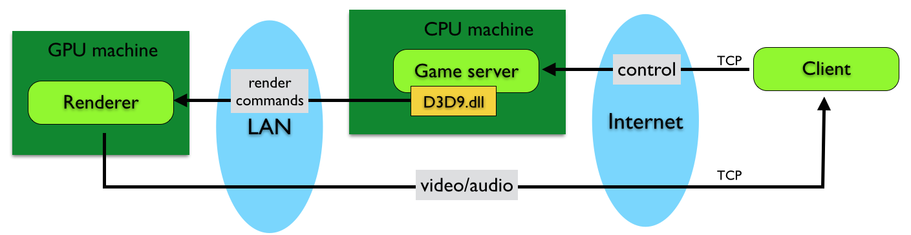

# CCDK Overview

CCDKは、"Community Cloud Development Kit" の略で、シンラ・テクノロジーが提供する、クラウドゲームを開発するためのソフトウェア・キットです。

このレポジトリ ( <a href="https://github.com/ShinraTech/CCDK">https://github.com/ShinraTech/CCDK</a> )では、CCDKのドキュメント、ソースコードつきのサンプルゲーム、
開発ツールのバイナリアーカイブを配布しています。

シンラ・テクノロジーは、CCDKのサポートを、
<a href="https://www.facebook.com/pages/Shinra-Community-CDK/1613401802228319">Facebookグループ</a> で主に行っています。
不明な点があれば、どんなことでも構いませんので、
グループで質問をしてみてください。

FAQ
====
TODO: implement

CCDKでできること・できないこと
====
CCDKでは、以下のことができます。

1. ゲームの制作とテストプレイ
CCDKでは、1:1, 1:N, N:Nモデル、の3つの通信モデルを用いたゲームを開発し、
ローカルでの描画結果をリモートにビデオストリーム送信して、
シンラの実運用環境を使った場合の画質や操作の遅延を実際に体験してみたり、
バックエンドサーバを用いた通信の動作確認をしたりすることができます。
(2015年4月の段階では、1:Nの開発はまだできません)
2. シンラの実環境に送るためのパッケージファイルを作成し、
それが壊れていないことをローカルでテストプレイして確認する
3. シンラの実環境に実際に送り、リモートからテストプレイし、エンドユーザが実際に体験する内容を確認する(2015年4月の段階では、まだ準備中のためできません。)

CCDKでは、以下のことができません。
1. 開発以外の目的のためにゲームをパブリッシュすること。特にシンラ・プラットフォームのエンドユーザを含む不特定多数のお客様に対してゲームをパブリッシュすること。
2. シンラのリモートレンダラのパラメータチューニングを行うこと。

MCS  (Minimal Cloud Set)
====
MCSはMinimal Cloud Setの略です。

MCSは、シンラ・システムのリモートレンダラの最小のエミュレータです。
CCDKは、MCSをベースとして設計されています。

以下の図では、シンラ・システムのコアシステム(商用サービス用のシステム)と、
MCSと、シンラ・システム無しのゲームをそれぞれ比較しています。

まず上の図は、シンラ・システム無しで、
DirectXを用いてゲームサーバーを動作させている状態を示しています。
一般的なDirectXを用いているゲームは、この状態です。
GPU、そして表示ディスプレイも、CPUと同じマシン上に搭載されているものが使われます。
D3D9.dllはここではフェイクされていず、Microsoft社が提供しているものをそのまま利用します。

上の図は、シンラの商用版システムの構成を示しています。
CPUマシンとGPUマシンは物理的に分離されており、データセンターのLAN内で、
10Gbps以上の超高速なネットワークを用いて接続されています。
CPUマシンではGame serverが、GPUマシンではRendererが動作しています。
エンドユーザ(ゲームを遊ぶ人)はClientプログラムを用いてゲームの操作情報(control)を
TCPソケットを用いてゲームサーバーに送信します。
D3D9.dllはフェイクされており、描画のための関数を呼び出すと、
その呼出がそのままゲームサーバーから高速ネットワーク経由でレンダリングサーバーに対して送られます。
レンダリングサーバーは描画コマンドを受信すると、GPUを使用して描画とエンコーディングを行い、
その結果がTCPストリーム経由でクライアントに送り返されます。
これが、シンラ・プラットフォームの特徴である「リモートレンダリング機能」です。

上図はMCSの構成を示します。商用版システムとは異なり、
CPUマシンとGPUマシンが物理的に分離されていることはなく、
レンダリングコマンドをネットワーク経由で送信することもありません。
ただしD3D9.dllはフェイクされており、
同じマシン上にあるGPUを利用して直接レンダリングと映像圧縮を行います。
クライアントは、商用サービスと同じようにネットワーク(TCP)経由で操作情報を送信し、
ビデオ信号を受信します。

MCSではクライアントとゲームサーバーの間にネットワークが存在するため、
ネットワークの設定を調節してネットワークの遅さをシミュレートし、
ゲームの操作や画面描画が遅れる感覚を検証したり、
画質や音質を実際に見てみることができます。
(画質については、MCSで見れるのはデフォルトの状態だけです。
コアシステムをパラメータチューンしたら画質は変化します。)

CCDKに含まれているMCSは、
シンラのデータセンターの外部においてシンラ・システム向けのゲーム開発を
出来る限り商用版に近い環境で行い、検証作業ができるようにするためにデザインされていますが、
商用版のDLLでサポートしている関数と完全に同じではありません。
そのためCCDKで開発したゲームを商用版システムで動作させたときには、
未知の問題が発生する可能性があります。
その場合は、シンラ・テクノロジーが技術サポートを行います。

MCSの最新版は、packagesディレクトリに格納されています。
ファイル名は以下のようになっています。
複数のバージョンが格納されていますが、通常は番号がもっとも大きい、
最新のものを利用してください。

<pre>
packages/ShinraMCS-8304.34.zip
</pre>

CCDKにおけるゲーム開発の手順
====
CCDKを使ってゲームを開発するときは、以下の手順で行います。

1. CCDKをセットアップし、それぞれのサンプルをひと通り動作させる。
2. MCSを使わずに、ゲームのプログラムやデータを実装する。1:1, 1:N, N:Nの3つのサンプルを拡張またはコピーして開発すると簡単です。
3. MCSを使って、ストリーミングプレイを検証する。
4. MCSを使って、ShinraPackを作成する。
5. ShinraPackを、CCDK用のテストサーバーで動作させて検証する。 (2015年4月は準備中)
6. ShinraPackを、商用サーバーにデプロイする。  (2015年4月は準備中)

CCDKの取得
====
CCDKは、圧縮ファイルではなく、GitHubのgitレポジトリで配布しています。
開発プロジェクトで使う場合は、各リリースに対応するgitのタグを用いてバージョンを固定すると便利です。

以下のコマンドラインで最新版を取得できます。

<pre>git clone https://github.com/ShinraTech/CCDK</pre>

CCDKのセットアップ
===
"CCDKセットアップドキュメント" を参照してください。 
