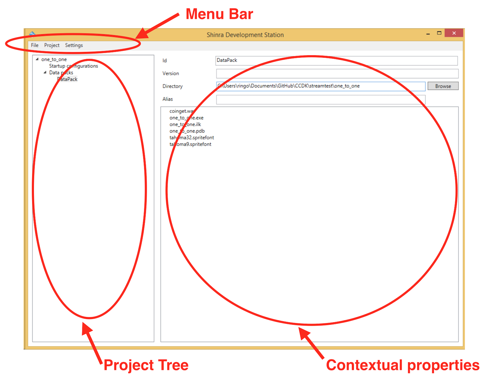

Shinra Development Station (SDS) 概要
====
Shinra Development Station (SDS) は、シンラのゲームプロジェクトを管理するためのツールです。
SDSの主な目的は、シンラのプロジェクトファイルを操作することです。

プロジェクトファイルは、ローカルでゲームをテストしたり、ゲームのパッケージを作成したり、
クラウドにデプロイしたりするために使います。


基本概念
----

SDSのGUIは3つの要素で構成されています。


画面上部にはメニューバーがあり、プロジェクトのセーブ、ロード、ゲームの開始、設定画面などを呼び出すことができます。

画面左側はプロジェクトツリーがあり、現在操作しているプロジェクトの情報を一覧できます。
プロジェクトは、データパックとスタートアップ設定を複数含むことができます。それらの内容については後述します。プロジェクトツリーの各要素をクリックすることで、右側の関連プロパティ画面を開くことができます。

画面右側の広い部分は、プロジェクトツリー内の現在選択されている要素に関連する詳細な設定情報を表示しています。


## SDS自体の設定

SDSツールそのものの設定は、メニューバーのSettingsから MCS configurationを選択することで確認できます(図)。


**Python executable** は```python.exe```へのパスです。 Python 3が必要です。CCDKの開発では、3.4を使っています。

**Shinra script path**  は ```shinra.py```へのパスです。　このスクリプトは、SDSの内部的に使われているもので、パッケージの作成や、ゲームのインストール、実行などを行います。デフォルトでは、SDSがあるディレクトリのサブディレクトリに格納されています。

**Shinra MCS path** はMCSのSDS以外のDLLなどのファイル群が格納されているディレクトリの位置です。通常MCSはSDSと同じ圧縮ファイルで提供されるので、SDSがあるディレクトリをそのまま指定するのでかまいません。　SDSはパッケージを作成する際に、このディレクトリからDLLをコピーするなどしてパッケージを完成させます。

**Games installation dir** は、SDSがローカル環境に対してゲームをインストールする際に使う作業用のディレクトリで、プロジェクトごとに個別のディレクトリが、ここで指定するディレクトリの中に作られます。ゲームデータ全体のコピーが含まれるので、十分な容量が必要です。

**Default game user id** シンラ・クライアントから接続するときに必要なユーザー名のデフォルト値を指定します。

**Force overwriting of game data on install** のチェックを外した状態にしておくと、ゲームに必要なファイルのうち、実際に変更されたもの(サイズか日付が異なるもの)だけがコピーされます。デフォルトではチェックは無しです。　これによって、大きいデータをもつゲームのインストール時間を短縮することができます。


## シンラ・プロジェクトの構成
シンラ・プロジェクトは、**データパック**と **スタートアップ設定**の2つの部分からなります。

データパックは、ゲームの動作に必要なファイルやディレクトリの構成を定義します。
スタートアップ設定は、ゲームをどのように起動するのか、またMCSの設定をどうするのかを定義します。

スタートアップ設定におけるファイルの位置は、データパック内のルートディレクトリからの相対で指定します。そのため有効なスタートアップ設定にはデータパック(複数をプロジェクトに含めることができる)を特定する必要があります。

典型的な手順ではまずデータパックを定義し、次にスタートアップ設定を定義します。その際には、データパックに含まれる実行ファイル(exeファイル)を起動ファイルとして指定します。

設定の具体例については　[Setup.jamd](Setup.ja.md) も参考にしてください。


### データパックを作る

シンラ・プロジェクトに含まれるデータパックは、データの位置を指定するだけで、
データ自体は含みません。データ自体が含まれた状態にするには、シンラ・パックを作成する必要があります。それは後述します。

以下の3つの方法でデータパックを作ることができます。

- ```Project```メニューから ```Add data pack```をクリックする。
- プロジェクトツリーの```Data packs```を右クリックして、 ```Add data pack```を選択する
- エクスプローラから、プロジェクトツリーにディレクトリをドラッグ&ドロップする。

データパックを作ると、以下の項目が設定可能になります。


- **Id** ほかのデータパックと区別するためのID。　任意の文字列を指定します。
- **Version**  データパックを追跡するためのバージョン番号です。デバッグに活用します。
- **Directory** データをコピーする元になるディレクトリの位置を指定します。
- **Alias** データが実際に展開されるディレクトリの名前を指定します。デフォルトではこれはコピー元のディレクトリと同じ名前になりますが、任意の名前を設定することができます。

### スタートアップ設定を作る

以下の3つの方法でスタートアップ設定を作成できます。

- ```Proejct```メニューで、 ```Add Startup configuration```をクリックする。
- プロジェクトツリーで```Startup configurations``` を右クリックし、```Add Startup configuration```を選択する
- 各データパックのファイルリストで、実行可能ファイルで右クリックし、```Add startup configuration```を選択する


スタートアップ設定を追加したら、以下の項目が設定できます。


- **Id** 他のスタートアップ設定と区別するためのID。自由な文字列を入力します。
- **Executable** データパック内の実行可能ファイルのパス(ルートからの相対)。
- **Arguments** 実行するときのコマンドライン引数
- **Work directory** 実行するときのワークディレクトリ(ルートからの相対)。
- **Data pack** 使用するデータパック。プロジェクト内で定義している必要があります。
- **Save data** ゲームサーバのプログラムが終了したときに自動的にセーブするファイルを指定します。　ファイルのパスをフィルタするための記述のリストか、ファイルフックを書きます。　次に同じユーザがこのゲームを実行したときに前回セーブされたファイルが自動的に書き込まれます。ゲームのセーブデータをこれによって簡単に実装できます。
- **Temp data** 一時データの位置。ゲームサーバのプログラムが終了したときに、ここで指定したパス(またはファイルフック)にあるファイルやディレクトリは、自動的に削除されます。

ファイルフックについては、 [MCS_README.ja.md](MCS_README.ja.md) でくわしく解説しています。

データパックのプレビューウインドウからテキストフィールドにファイルをドロップすると便利です。また、2つ以上のスタートアップ設定をひとつの実行ファイルに割り当てることもできます。


## MCS でゲームを実行する
MCSを使って、ローカル環境でゲームを実行することができます。

### ゲームを開始する
2つの方法でゲームを開始できます。

- メニューの```Project```から、 ```Start game```を選択して、開始したいスタートアップ設定を選択します。
- プロジェクトツリーから、開始したいスタートアップ設定を右クリックし、 ```Start game``` を選択します。

ゲームを始めると、SDS自体に設定されたゲームのインストールディレクトリ ```Games installation dir``` の中にゲームがコピーされ、必要なDLLなどが自動的にインストールされ、そこでゲームが開始されます。
インストールが完了すると、ゲームの実行管理ウインドウが表示されます。

When starting a game, the game data will be deployed in the directory specified under the "MCS configuration", and then executed there. Once the installation is over you will be prompted the Game running window.

### ゲームの実行管理ウインドウ

プロジェクトメニューから ```Start game```を選択すると以下のようなウインドウが表示されます。


ひとつのスタートアップ設定から、複数のゲームを起動することができます。
このウインドウでは1行がひとつのゲームの実行インスタンスに対応します。
インスタンスとはWindowsにおけるゲームサーバのプロセスひとつのことです。
たとえば3人でのマルチプレイを試したい場合は、インスタンスが3つ、この設定が3行必要です。

それぞれの行に表示されている内容は以下の通りです。


- **User id** インスタンスで使われるユーザーのIDを指定します。複数のインスタンスでひとつのユーザーIDを共有することはできません。それぞれ異なるユーザーIDを指定してください。
- **Game port** ゲームポートのTCPポート番号を指定します。ゲームポートとは、シンラ・クライアントからゲームサーバに対して操作情報を送るためのTCPポートです。このポート番号はほかのプログラムによって占有されていない必要があります。
- **Video port** ビデオポートのTCPポート番号を指定します。ビデオポートとは、シンラ・クライアントが映像データを受信するためのTCPポートです。このポート番号はほかのプログラムによって占有されていない必要があります。
- **Game** ゲームを開始/停止するボタンです。インスタンスに設定されたユーザーIDやポート番号などの設定をともなってゲームを開始します。　ゲームを開始できる状態のときは ```Start``` 、一旦開始すると　```Stop``` ボタンに変わります。
- **Client** シンラ・クライアント(ビデオビューワ)を開始するボタンです。インスタンスに設定されたゲームポートとビデオポートの設定を使って適切にクライアントを設定して起動します。デフォルトでは、ゲームを起動すると自動的にクライアントも起動します。ほかのコンピュータから接続してテストプレイしたい場合は、このオプションをはずしてください。

インスタンスのリストの空白部分部分で右クリックし、 ```Add game instance```を選択すると、新しいインスタンスを追加することができます。また、インスタンスを選択してdeleteキーを押すことでインスタンスを削除できます。


## シンラ・パック
プロジェクトは、簡単にパッケージ化することができます。
パッケージとは、ゲームの実行に必要なすべて(実行ファイルやデータなど)を含むひとつのzipファイルです。
パッケージ化することで、ゲームのアーカイブをしたり、チームメンバー間で共有したり、シンラテクノロジーのデータセンターにアップロードしてデプロイしたりすることができます。

### シンラ・パックの作成
```Project``` メニューから ```Build ShinraPack``` を選択するだけです。
指定した位置に zipファイルができていることを確認してください。


## シンラ・パックの読み込み

SDSは通常はシンラのプロジェクトファイル(拡張子が .shinra )を読み込みます。プロジェクトファイルにはシンラ・パックとは異なり、exeファイルなどが含まれていません。

しかしシンラ・パックには、プロジェクトの情報が含まれているので、
SDSはシンラ・パックを読み込んで、プロジェクト内容の編集を再開することが可能です。

シンラ・パックを読み込むには、```File```メニューから ```Import project```を選択し、以下の情報を設定します。

- ```Import from packages``` 読み込むzipファイルの位置
- ```Store data in``` プロジェクトのデータをどこに展開するか
- ```Project file``` プロジェクトファイルの名前

