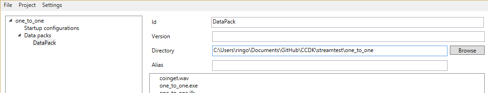

Shinra Development Station (SDS) 概要
====
Shinra Development Station (SDS) は、シンラのゲームプロジェクトを管理するためのツールです。
SDSの主な目的は、シンラのプロジェクトファイルを操作することです。

プロジェクトファイルは、ローカルでゲームをテストしたり、ゲームのパッケージを作成したり、
クラウドにデプロイしたりするために使います。


基本概念
----

SDSのGUIは3つの要素で構成されています。


画面上部にはメニューバーがあり、プロジェクトのセーブ、ロード、ゲームの開始、設定画面などを呼び出すことができます。

画面左側はプロジェクトツリーがあり、現在操作しているプロジェクトの情報を一覧できます。
プロジェクトは、データパックとスタートアップ設定を複数含むことができます。それらの内容については後述します。プロジェクトツリーの各要素をクリックすることで、右側の関連プロパティ画面を開くことができます。

画面右側の広い部分は、プロジェクトツリー内の現在選択されている要素に関連する詳細な設定情報を表示しています。


## SDS自体の設定

SDSツールそのものの設定は、メニューバーのSettingsから MCS configurationを選択することで確認できます(図)。


**Python executable** は```python.exe```へのパスです。 Python 3が必要です。CCDKの開発では、3.4を使っています。

**Shinra script path**  は ```shinra.py```へのパスです。　このスクリプトは、SDSの内部的に使われているもので、パッケージの作成や、ゲームのインストール、実行などを行います。デフォルトでは、SDSがあるディレクトリのサブディレクトリに格納されています。

**Shinra MCS path** はMCSのSDS以外のDLLなどのファイル群が格納されているディレクトリの位置です。通常MCSはSDSと同じ圧縮ファイルで提供されるので、SDSがあるディレクトリをそのまま指定するのでかまいません。　SDSはパッケージを作成する際に、このディレクトリからDLLをコピーするなどしてパッケージを完成させます。

**Games installation dir** は、SDSがローカル環境に対してゲームをインストールする際に使う作業用のディレクトリで、プロジェクトごとに個別のディレクトリが、ここで指定するディレクトリの中に作られます。ゲームデータ全体のコピーが含まれるので、十分な容量が必要です。

**Default game user id** シンラ・クライアントから接続するときに必要なユーザー名のデフォルト値を指定します。

**Force overwriting of game data on install** のチェックを外した状態にしておくと、ゲームに必要なファイルのうち、実際に変更されたもの(サイズか日付が異なるもの)だけがコピーされます。デフォルトではチェックは無しです。　これによって、大きいデータをもつゲームのインストール時間を短縮することができます。


## シンラ・プロジェクトの構成
シンラ・プロジェクトは、**データパック**と **スタートアップ設定**の2つの部分からなります。

データパックは、ゲームの動作に必要なファイルやディレクトリの構成を定義します。
スタートアップ設定は、ゲームをどのように起動するのか、またMCSの設定をどうするのかを定義します。

スタートアップ設定におけるファイルの位置は、データパック内のルートディレクトリからの相対で指定します。そのため有効なスタートアップ設定にはデータパック(複数をプロジェクトに含めることができる)を特定する必要があります。

典型的な手順ではまずデータパックを定義し、次にスタートアップ設定を定義します。その際には、データパックに含まれる実行ファイル(exeファイル)を起動ファイルとして指定します。

設定の具体例については　[Setup.jamd](Setup.ja.md) も参考にしてください。


### データパックを作る

シンラ・プロジェクトに含まれるデータパックは、データの位置を指定するだけで、
データ自体は含みません。データ自体が含まれた状態にするには、シンラ・パックを作成する必要があります。それは後述します。

以下の3つの方法でデータパックを作ることができます。

- ```Project```メニューから ```Add data pack```をクリックする。
- プロジェクトツリーの```Data packs```を右クリックして、 ```Add data pack```を選択する
- エクスプローラから、プロジェクトツリーにディレクトリをドラッグ&ドロップする。

データパックを作ると、以下の項目が設定可能になります。



- **Id** ほかのデータパックと区別するためのID。　任意の文字列を指定します。
- **Version**  データパックを追跡するためのバージョン番号です。デバッグに活用します。
- **Directory** データをコピーする元になるディレクトリの位置を指定します。
- **Alias** データが実際に展開されるディレクトリの名前を指定します。デフォルトではこれはコピー元のディレクトリと同じ名前になりますが、任意の名前を設定することができます。

### スタートアップ設定を作る

以下の3つの方法でスタートアップ設定を作成できます。

- Click "Add Startup configuration" in the Project menu.
- Right click on the "Startup configurations" section in the project tree and select "Add Startup configuration".
- For a given Data pack, right click on an executable file you want to start and select "Add startup configuration".

Once you have your Startup configuration created, you can configure the different properties:
- **Id** is a string used to identify this startup configuration form the others.
- **Executable** is the path to the executable inside the data pack.
- **Arguments** will be used when running the executable.
- **Work directory** will be used as the current work directory for the execution. The path is relative to Data pack itself.
- **Data pack** will be used as the reference for path definition.
- **Save data** is a list of Path filter expressions (or file hooks) used to define what game file needs to be redirected and saved on the end of a game execution. The data will be restored on the next execution of the same game for the same user.
- **Temp data** is a list of Path filter expressions (or file hooks) used to define what game file needs to be redirected and discarded on the end of a game execution.

See "File hooks" in MCS_README for more information on the file hooks configuration and inner workings.

Note you can drag the files from the data pack preview window to the text fields.
You can also have multiple startup configurations pointing at the same executable in the same data pack and using different arguments.

## MCS Game execution
Projects can be deployed locally and executed using MCS.

### Start a game
You can start a game using MCS in two different ways:
- In the Project menu select "Start game", then select the startup configuration you want to run.
- Right click on a given Startup configuration and select "Start game".

When starting a game, the game data will be deployed in the directory specified under the "MCS configuration", and then executed there. Once the installation is over you will be prompted the Game running window.

### Game running window
When running a game you are presented with a window enabling to start several instances of the game. Each instance is composed of:
- **User id** to be used for this particular instance of the game. Note we cannot have multiple instances of the same game with the same user id. Each instance has to have a specific user id.
- **Game port** to be used for this particular instance of the game. The port must be available and not conflict with the other ports of other game instances.
- **Video port** to be used for this particular instance of the game. The same restrictions than for the Game port applies here.
- **Game** start button. This will start the game instance itself with the specified user id, game port and video port.
- **Client** start button. This will start the client application with the specified game port and video port. By default the client is started automatically when the game is started. You can disable this option in case you want to run the client from another computer.

You can add a new game instance by right clicking in the list and select "Add game instance". You can remove a game instance by clicking on a instance and hit delete key.


## ShinraPack packaging
Projects can be packaged in a ShinraPack archive for deployment on the Cloud servers. 

### Create a ShinraPack
You can create a ShinraPack in two different ways:
- In the Project menu select "Build ShinraPack".
- Right click on the project item in the project tree and select "Start game".

## Importing a project
A package project can be re-imported to create a new shinra project. To import a project click File and Import project. This will open the import dialog box. You need to specify:
- Import from package: The zip file containing the packaged project.
- Store data in: A directory where the project data will be extracted to.
- Project file: The name of the new project file to be created.

