Setting Up CCDK <rem fix>
===============

The following sections detail the steps required to setup CCDK:

1. Download the CCDK repository using a Git client
2. Install additional external tools (including Python and Ruby)
3. Test the CCDK sample programs
4. Test the backend server on Linux or OS X

Sections 1 through 3 cover CCDK's complete setup process in Windows environments.
Steps related to Linux and OS X will be covered in section 4.

##1. Download the CCDK repository using a Git client

The CCDK is currently stored in a private GitHub repository.

A Git client is needed in order to clone the repository and download CCDK.

All changes to the sample code and documentation in the CCDK repository are managed through direct commits and pushes by the CCDK development team.

GitHub was selected as the host for our project because of its simplicity and reliability in delivering updates to individuals using our library.
In addition to the ability to clone repositories, the use of Git allows us to rollback the repository to older versions of the program.
Git also allows us to create branches enabling the development team to manage personal changes to the repository, such as the creation of bug fixes and pull requests, with ease.

The link to the CCDK Git repository is listed below.
<pre>
https://github.com/ShinraTech/CCDK
</pre>

The link above will take you to the CCDK repository page listed under the ShinraTech organization.

Cloning this repository downloads CCDK, including its history, in its entirety.
Since the clone command contains information from all versions of the repository, you can access any version you may need through the use of the 'git checkout' command.

If you are already familiar with and know how to use Git, feel free to skip to section 3 **(Install additional external tools (including Python and Ruby)**).

Git runs on Windows, Linux and OS X and can be used via a number of various command-line and GUI clients.

CCDK was designed primarily as a tool for Windows.
For this setup guide, we will be using the GitHub’s official **GitHub for Windows** client as the client in our examples.

Start by accessing the URL below to download and installing GitHub for Windows.
<pre>
https://windows.github.com/
</Pre>
Once installed, the program can be launched from the Windows Start Menu by navigating to [Start] → [All Programs] → [GitHub, Inc] and selecting the [GitHub] program.

Once the GitHub program has loaded, a new repository can be added by clicking the [+] button located in the upper left corner of the program window.

The 'Add' command adds an existing directory as a repository and the 'Create' command creates an entirely new repository.
The 'Clone' command is used to download an existing repository from GitHub. Click the [Clone] button.

Once you have joined one of the teams in the ShinraTech organization, you will see a picture like the one displayed below.

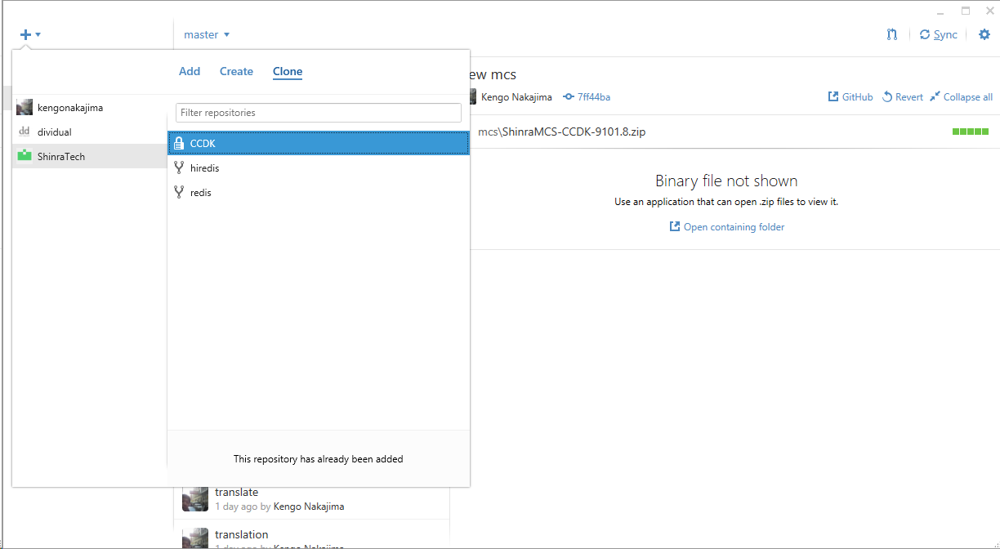

Clicking this icon will display a list of repositories used or maintained by the ShinraTech organization. Select 'CCDK' from the list. This will clone and download the CCDK repository. The download should finish within a few minutes.

If the username for your Windows account was 'cloud', any repositories that have been cloned will be downloaded to the location below by default.
The default location changes based on the version of 'GitHub for Windows' that is being used.
Open the settings window by clicking the [gear icon] to confirm the default save location for downloaded repositories.

<pre>
C:¥Users¥cloud¥Documents¥GitHub¥CCDK
</pre>

###2. Install Additional External Tools (including Python and Ruby)
CCDK depends on the external tools listed below.
The tools listed here refer to the tool versions used on Windows. The tool versions used on Linux(UNIX) will be introduced in subsequent sections.

* Python 3.4 (3.4.1)
* Ruby 2.1 (2.1.5p273)
* VisualStudio 2013
* Redis (MSOpenTech Version)

All of the tools listed above should be compatible with CCDK regardless of their minor version numbers. However, the CCDK development team has only confirmed compatibility with the tools listed here.
If you have problems running CCDK or you would like to have CCDK verified with another version of the external tools listed here, contact a development team member for more information.

Use the link below to download Python 3.4. 
<pre>
https://www.python.org/downloads/windows/
</pre>
The 'python.exe' program should install itself to the path below during a normal installation. Add this file path to your Windows Environment 'PATH' variable.
<pre>
C:¥python34¥python.exe
</pre>
Open up a command prompt and type 'python'. If you see output similar to the output shown below, your python settings were successfully applied.
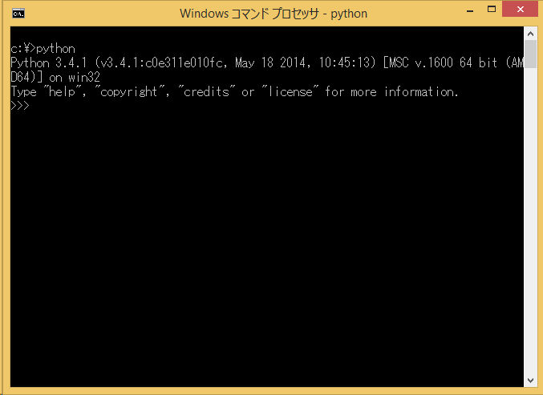

Ruby 2.1 can be installed by using the installer below.
<pre>
http://rubyinstaller.org/downloads/
</pre>
The 'ruby.exe' program should install itself to the path below during a normal installation. Add this file path to your Windows Environment 'PATH' variable.

<pre>
C:¥ruby21-x64¥bin¥ruby.exe
</pre>
Just like the confirmation for Python, open up a command prompt and type 'ruby' at the command line.
If you see output similar to the output shown below, your Ruby settings were successfully applied.

CCDK is compatible with the free version of Visual Studio 2013.
Visual Studio 2013 Professional was used for the development of CCDK.

The free version can be downloaded directly from Microsoft's website using the link below.
<pre>
https://www.visualstudio.com/downloads/
</pre>

A Visual Studio compatible version of Redis has been ported from the official project site.
Compiling the MSOpenTech version of Redis generates libraries that will be referenced when using Redis in Visual Studio.

If you have cloned the CCDK repository using 'GitHub for Windows', the Redis source code will be automatically checked out to the directory below.
<Pre>
CCDK/externals/redis
</pre>
<Pre>
CCDK/externals/redis/msvs/RedisServer.sln
</prE>
Opening and doing a complete build of the Visual Studio solution listed above will generate a number of files as listed below.
<pre>
CCDK/externals/redis/msvs/Debug/hiredis.lib
CCDK/externals/redis/msvs/Debug/redis-server.exe
</pre>
These files will be used to build the backend server.
Build both the Debug and Release versions of Redis.

###3. Test the CCDK Sample Programs

The programs listed below are can be tested using a single Windows machine.

1. 1:1 (One-to-One) Skeleton Program (Windows)
2. N:N (Many-to-Many) Skeleton Program (Windows)
3. Backend Server Program

CCDK front-end library testing can be divided into 2 major steps.
The first step consists of conducting tests on the libraries with video streaming disabled.
After completion of step 1, step 2 consists of conducting the same test with video streaming enabled.

Tests on the backend server are conducted using the N:N front-end skeleton program.
There is a Windows version and a UNIX (Linux/OS X) version of the backend server.
Usage of the Linux version will be covered in subsequent sections.

The CCDK library test process follows the steps below:

1. Make a complete build of the CCDK libraries
2. Perform validation tests on the one-to-one skeleton program with video streaming disabled
3. Perform validation tests on the N:N skeleton program with video streaming disabled
4. Perform validation tests on the one-to-one skeleton program with video streaming enabled
5. Perform validation tests on the N:N skeleton program with video streaming enabled

<B>Step 1 - Make a complete build of the CCDK libraries</B>

The Visual Studio solution file for the CCDK library can be opened from its location in the top directory of the CCDK repository.

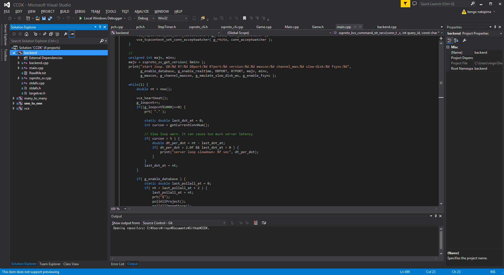

A complete build can be made by pressing the [build] button. This will compile the entire project.
During the build process, the DirectX ToolKit package will be automatically downloaded and installed by NuGet.

<B>Step 2 - Perform validation tests on the one-to-one skeleton program with video streaming disabled</B>

To test the one-to-one skeleton program, set the "one_to_one" project as the startup project for the solution and run the program in debug mode.

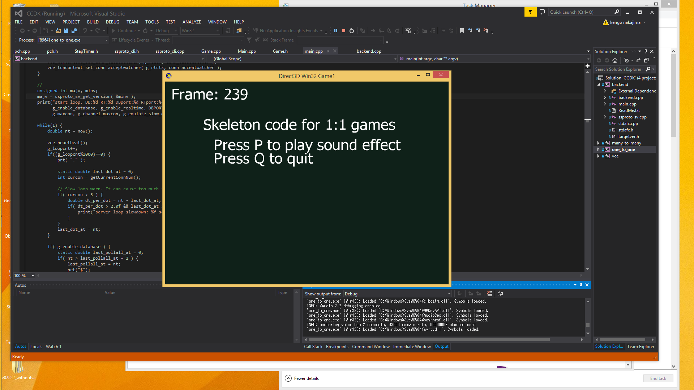

The test is successful if a window is displayed and the frame count continues to increase (as shown above).
You can end the test by pressing the [Q] key or closing the window directly.

<B>Step 3 - Perform validation tests on the N:N skeleton program with video streaming disabled</B>

Launch the many_to_many program without launching the backend server.

In contrast to the to the one_to_one program, the many_to_many program window attempts to increment the values for the 'Ping:0' and 'Channelcast:0' variables.
The ping variable is related to the number of ping responses received from the backend server.
This should remain at 0, meaning the many_to_many program was not able to connect to the backend server. The Channelcast variable should also remain at 0 for similar reasons.

Stop the program and launch the backend server.
Debugging the backend server is not one of the objectives of this next test, so launch the backend project using the normal run command.
When running the backend server with its database functionality enabled, the Redis server also needs to be launched. However, the CCDK solution file is set to run the backend server with database functionality disabled by default.
The process for launching the Redis server will be covered in a subsequent section.

When the backend server launches, a console window as shown below will be displayed and logging information will be output to the window.
Debugging information will also be displayed in Visual Studio.
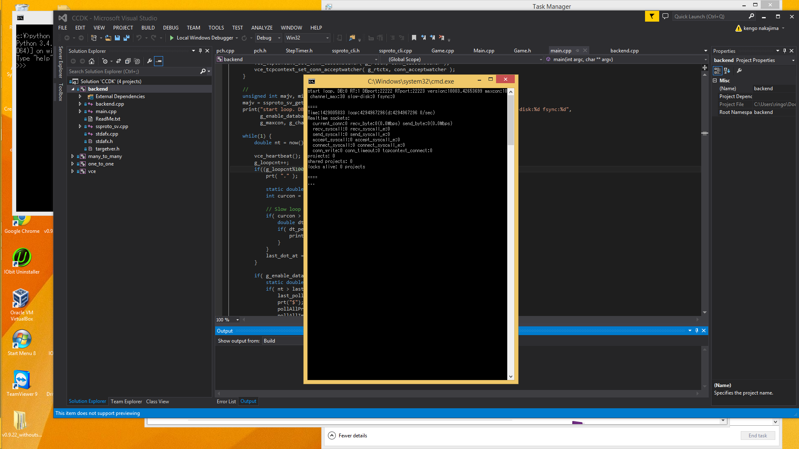

If you would like to run the backend server using Visual Studio's debug mode, launch another instance of Visual Studio.

Running an additional many_to_many program in normal mode generates output as shown below.
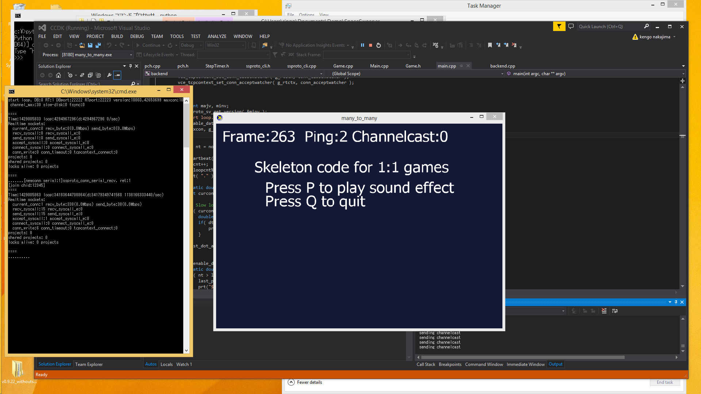

The value of the 'Ping' counter variable should begin to increase. This proves that communication with the backend server is being made successfully. However, the value of the 'Channelcast' variable should still be at 0. This is because the channelcast method for communication transmits information to all other processes except for itself.

We will run an additional many_to_many program on top of this.

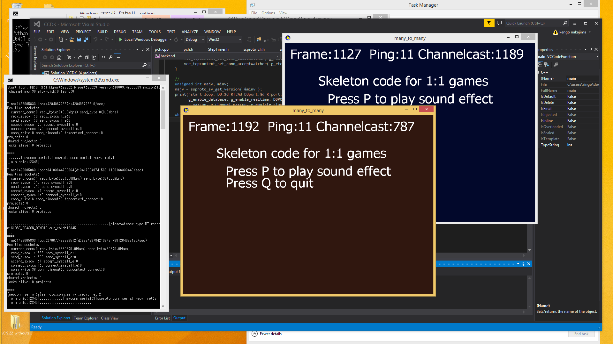

The value of the Channelcast variable should now increase once for each generated frame.
The current many_to_many program should be transmitting a single channelcast packet to the channel (ID=12345) for each frame generated.
As additional programs connect to the backend server, the number of channelcast packets being sent should increase exponentially.
By launching even more many_to_many programs in addition to what is currently being run, packet transmission speed can be benchmarked as well.

<B>Step 4 - Perform validation tests on the one-to-one skeleton program with video streaming enabled</B>

The MCS package, located in the CCDK/mcs directory, is required to test video streaming.
The MCS package can be extracted to a location of your choosing.
For this example, we will extract the MCS package in its current location (as shown below).
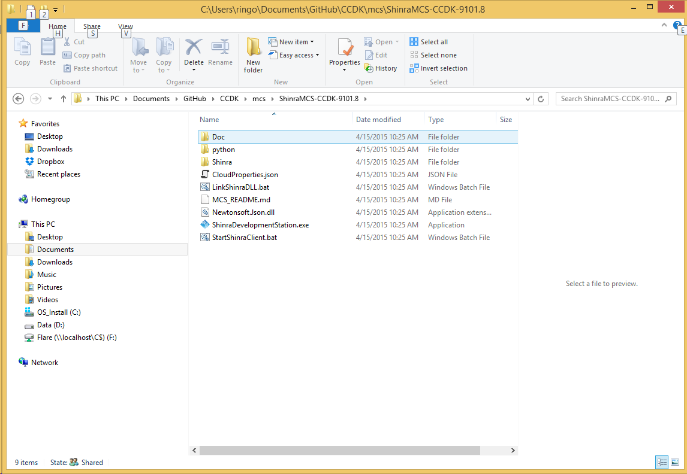

The number 9101.8 is the current build number for MCS. This number will change as new versions of MCS are released.

When package extraction has completed, run the ShinraDevelopmentStation.exe program.
By default, Windows displays a warning when an unsigned program is run; choose to run this program. From here on, the ShinraDevelopmentStation.exe program will be referred to as SDS.

Python must be installed because SDS uses Python internally.

When the SDS program has been run, an empty window like the one below should be displayed.
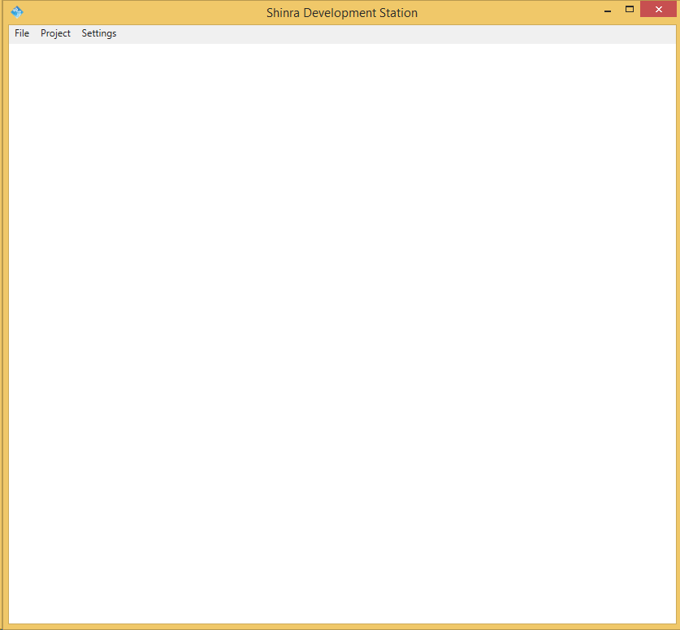

SDS is a GUI tool for making packages for games. SDS's usage will be covered in a separate document.

SDS settings can be confirmed by selecting 'Settings > MCS Configuration' from the menu. This will display a dialog box like that shown below.
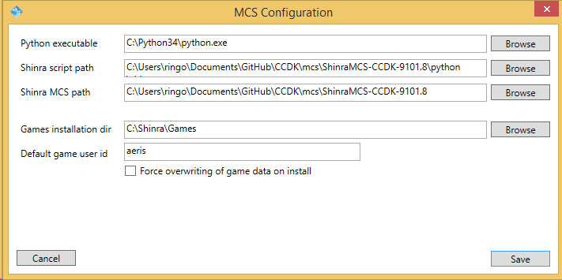

The row at the top represents the path for the Python executable file. If the file does not exist, the row will be surrounded by a red border.
Values for the Shinra script path and the Shinra MCS path are automatically detected relative to the location of the SDS file that was launched.
The 'Games installation dir' is used by the SDS program as a working folder. All copies of game components are stored here. Create the directory if it does not already exist. The 'Default game user id' variable can be left as it is.

Select 'File > New' from the menu to create a new project.
A window with 'New Shinra Project' will be displayed. Enter a name for the project and save it as a '.vcxproj' file.
For the purposes of this document, we will refer to the name of this project as sdstest. 
Save this file to a location of your choosing.
Next, selecting 'Project > Add Data pack' from the menu will display a window like the one below.
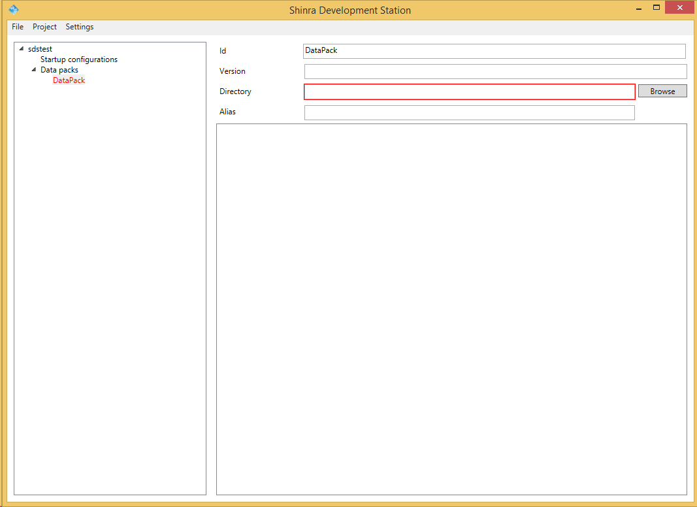
A DataPack is a folder or directory containing all the files needed to run the game.

In order to reduce the setup time required to run the SDS program, the 'CCDK/streamtest' directory was created at the top of the CCDK repository. Files such as the 'one_to_one.exe' and the 'many_to_many.exe' as well as any required image files are stored here.
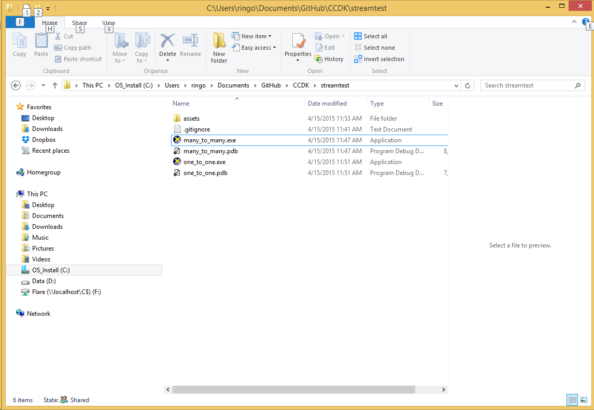
Run the 'one_to_one.exe' by double clicking it to confirm that it can be launched.

This directory will be added as a DataPack.
Select 'Project > Add Data Pack' from the menu and click the [browse] button. Select the 'streamtest' folder and press 'OK'.
If the new settings have been applied successfully 'sdstest > Data packs > DataPack' should now be viewable in the tool tree on the left side of the screen.
Multiple DataPacks can be added, but for this test we'll only be using one DataPack.

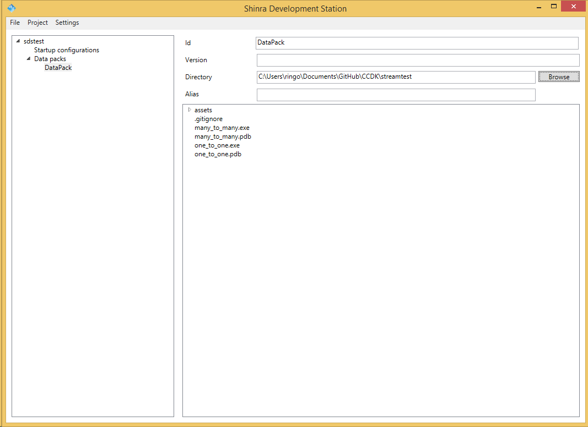

Next, we will specify which file from the DataPack should be treated as an executable file using startup configurations.
Selecting 'Project > Add Startup configuration' will display a screen as shown below.
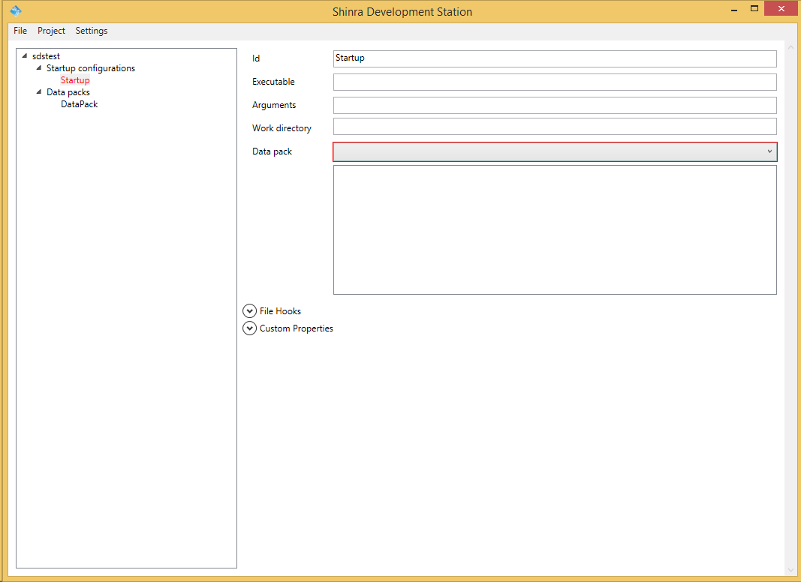

The Data Pack entry should be highlighted by a red box. This means that a data pack has not been selected. Click the area highlighted by the red box and select the data pack that we just added to the project.

Enter 'one_to_one.exe' directly into the 'Executable' input box. Once the red box has disappeared your input has been applied.

After selecting an executable, we will also need to specify a working directory. Since, we would like to run the program in the top directory of the data pack, we will specify '.' as the working directory.

Finally, we need to test that the project runs. Select 'Project > Start game > Startup'.

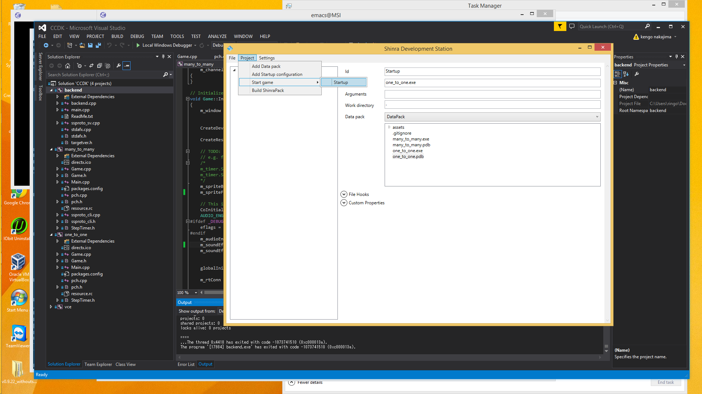

After clicking on 'Startup' a [Start] button as shown below should be displayed.

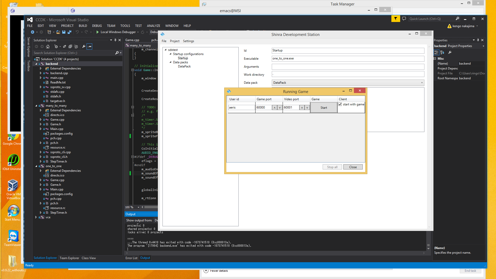

Data, including that relating to usernames and port numbers, will be displayed. More information about this data will be covered in a separate document. Press the [Start] button.

Two windows should be displayed. Since this is the first run, a Windows security warning might be displayed. Give the program permission to run to avoid addtional warnings. The first window should be named 'Direct3D Win32 Game1'. This is the window for the one_to_one.exe program. The second window should be named 'ShinraClient'. This is the video stream viewer window.

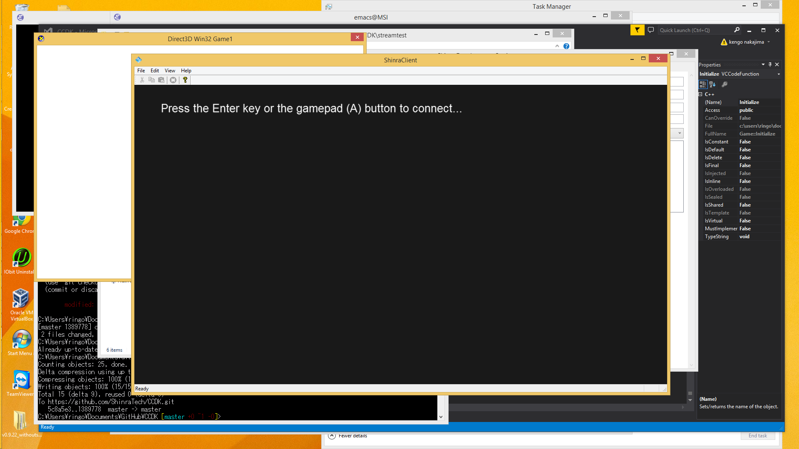

Select the 'ShinraClient' window to make this the active window and press Enter. You will see a video stream similar to that shown below.
There will be a difference in the quality of the graphics rendered in comparison to images rendered without a video stream. The 'P' key can be pressed to play sounds. You might notice that the timing for sound playback suffers from latency issues. Since a personal server differs from Shinra system's commercial service, note that there may be issues with picture and sound quality or latency.
Since the 'one_to_one.exe' executable window does not render any graphics, it should display a blank window.

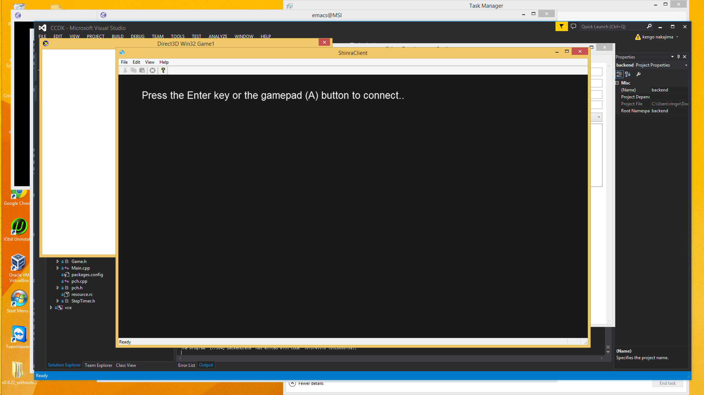

Close the ShinraClient and press the [Stop] button on the SDS to end the test.

<B>Step 5 - Perform validation tests on the N:N skeleton program with video streaming enabled</B>

The DataPack that we selected in step 4, the 'CCDK/streamtest' directory, also contains the 'many_to_many.exe' program. By adding an additional startup configuration through the SDS program, we can test the video streaming capabilities of the 'many_to_many' program.

First, launch the backend server from the 'CCDK.sln' solution file as we did in step 3.
You can choose whether to run this with or without the debugger.

Next, in the SDS select 'Project > Add Startup configuration'. Set the DataPack folder as the data pack and the 'many_to_many.exe' program as the 'Executable'. Set the working directory to '.' in the same way that we set the working directory for step 4.
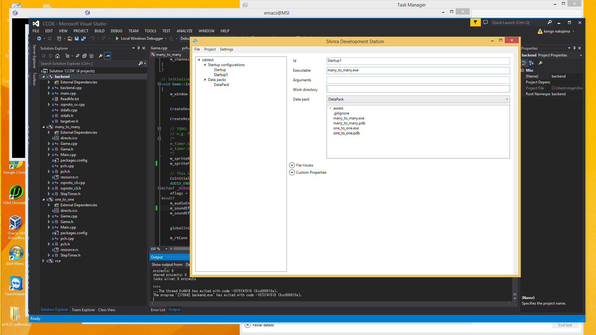

An additional startup configuration, named 'Startup1', should be visible in the tree view on the left side of the SDS screen.

Once 'Startup1 'has been added, run the program following the steps used in step 4 by selecting 'Project > Start game > Startup1'. A video stream should be displayed. If the value of the 'Ping' variable increases the test was successful.

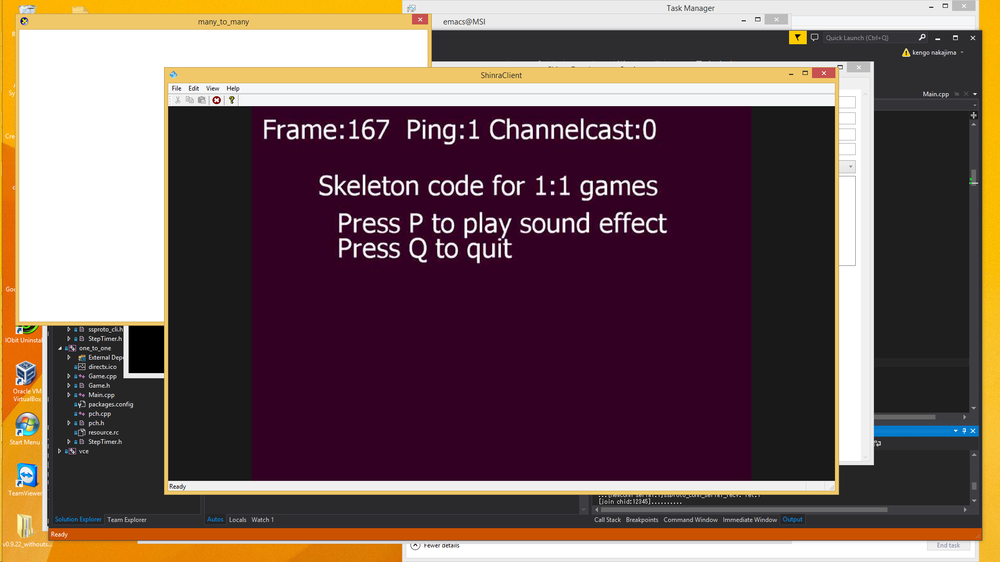

Multiple 'many_to_many.exe' programs can be launched by right clicking the grey area next to the [start] button and selecting 'Add game instance' from the displayed popup menu (as shown below).
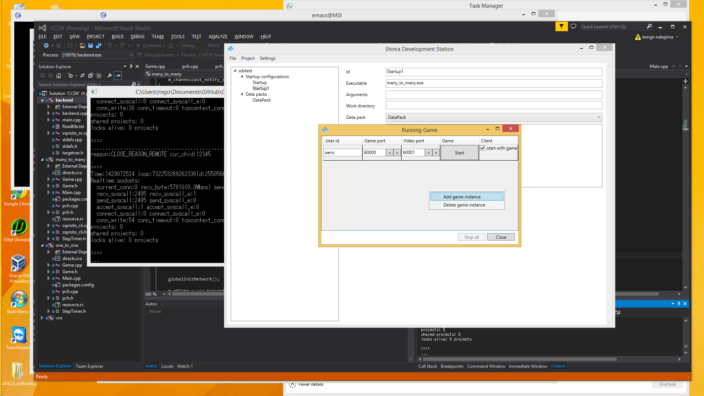

Doing this allows you to launch two game windows each with separate port numbers.

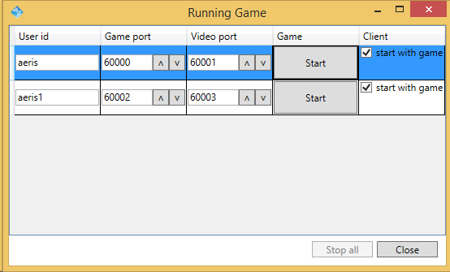

By pressing the start buttons on the respective windows, two 'many_to_many.exe' programs and 'ShinraClients' should be launched.

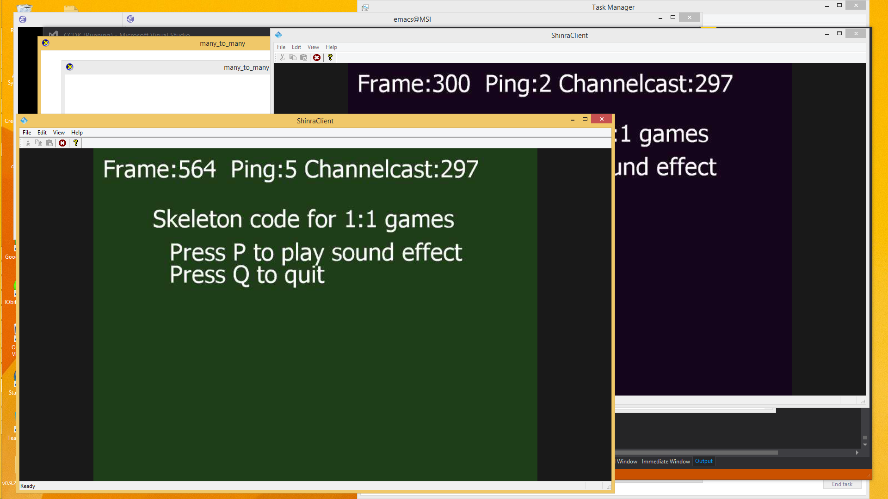

If the value of the 'Channelcast' counter increases then the test is complete.
A number of additional clients can be created in the same manner.

###4. Test the backend server on Linux or OS X
The backend server can also be run on Linux or OS X.
This can be achieved by:

1. Setting up the Linux operating system
2. Installing required external tools and libraries
3. Obtaining CCDK via Git
4. Compiling/building the backend server
5. Launching the Redis server
6. Launching the backend server

<B>Step 1 - Setting up the Linux operating system</B>

CCDK has been tested and run using Ubuntu server 14.04.2 and 10.04.
Because CCDK is open source, and the library does not use any of the new features of the Linux kernel, it should be possible to run CCDK on the majority of Linux distributions.

If you already know how to set up Linux, feel free to skip ahead to step 2.
If you will be running the backend server on OS X, skip this step.

We will go over a method for setting up a completely free Linux server environment using Ubuntu Server on VirtualBox.

First, download VirtualBox from the official website.

[http://www.oracle.com/technetwork/server-storage/virtualbox/downloads/index.html](http://www.oracle.com/technetwork/server-storage/virtualbox/downloads/index.html)

VirtualBox can be installed on either Windows or OS X.

Next, download the Ubuntu Server from the official website.
[http://www.ubuntu.com/download/server](http://www.ubuntu.com/download/server) 

Download the ISO file named 'ubuntu-14.04.2-server-amd64.iso' (similar ISO file names will also work). The file should be approximately 600MB in size. You should not have any issues if version numbers differ slightly. Ubuntu-desktop can also be used as a host for the backend server.

Launch VirtualBox and install a new virtual machine by clicking the New button.
The virtual machine should be set as a Linux, Ubuntu 64bit environment with 2GB of memory and a variable disk size with a max of 20GB.
When the virtual machine launches, you will be prompted for the file location of the Ubuntu image disk.
Select the location of the ISO file that was just downloaded.
The rest of the installation will proceed as a normal Ubuntu installation, and you will be prompted to configure a number of settings such as your keyboard type, the system time and your user account name.
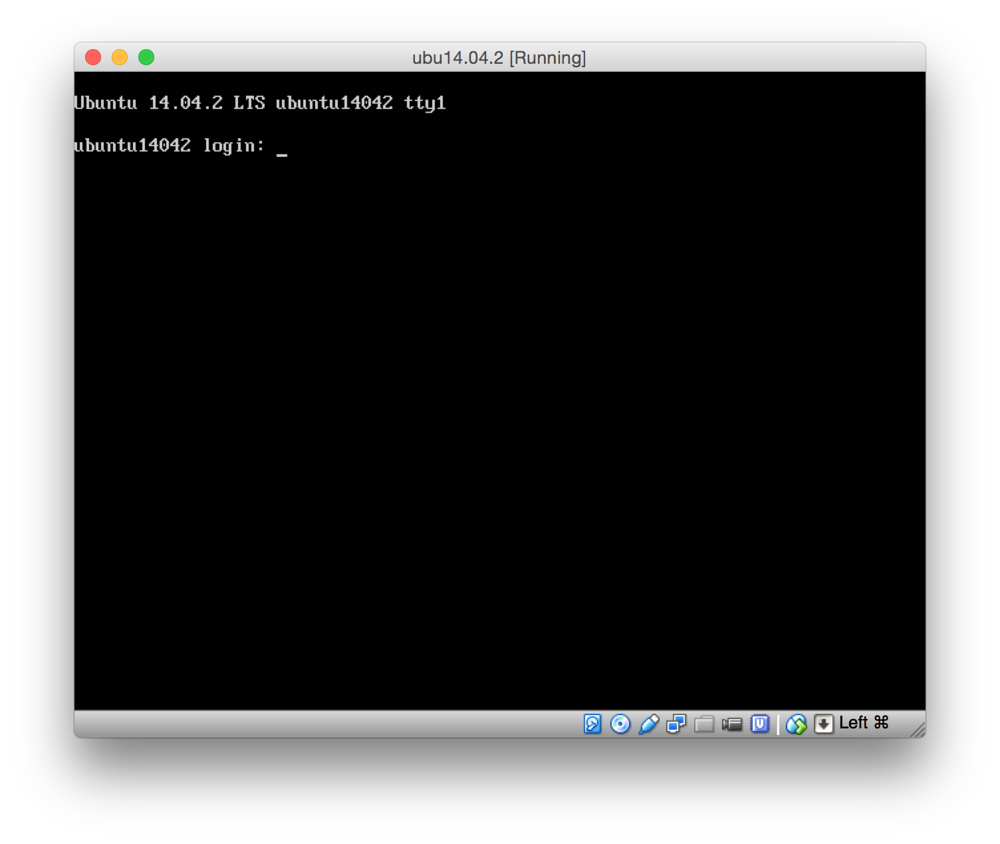
Once a screen like the one as shown above is displayed, your installation is complete.

<B>Step 2 - Installing required external tools and libraries</B>

The steps below detail the process for installing the required external libraries and tools on Ubuntu.
The standard installation for Ubuntu server provides us with a minimal setup, so a number of tools and libraries will need to be installed.
We will be installing 'git', 'make', 'gcc', 'ruby', 'ruby-dev', 'racc', 'g++', 'zlib1g-dev', and ' redis-server'.
These can be installed by entering the following commands at the command prompt.
<Pre>
bash$ sudo apt-get install git
bash$ sudo apt-get install make
bash$ sudo apt-get install gcc
bash$ sudo apt-get install ruby
bash$ sudo apt-get install ruby-dev
bash$ gem install racc
bash$ sudo apt-get install g++
bash$ sudo apt-get install zlib1g-dev
bash$ sudo apt-get install redis-server
</pre>

Next we will install 'hiredis'.
'Hiredis' is a protocol library that allows the program to access the Redis server.
'Hiredis' is not available thorugh Ubuntu's package manager, so it will have to be built from its source.

The source for 'hiredis' can be obtained and installed by running the following commands at the command line.
<pre>
bash$ git clone git@github.com:ShinraTech/hiredis
bash$ cd hiredis
bash$ make
bash$ make install
</pre>

This completes the installation of the external libraries and tools for Ubuntu 10.04.
These steps have not been tested on other distributions of Linux, but the setup process should be similar.
The hiredis shared libraries are required to run the backend server on Linux.
As such, then creation of an environment variable for the dynamic linker in your '.bashrc' is recommended.
The actual path of the hiredis shared libraries was output with the 'make install' command, so check the output of that command for the file path to the hiredis libraries on your system.
<pre>
LD_LIBRARY_PATH=/usr/local/lib
</pre>

If XCode and command line tools have been installed for OS X and you are running a Homebrew environment, external library setup is limited to 'redis', 'hiredis' and 'racc'.
<pre>
bash$ brew install redis
bash$ brew install hiredis
bash$ gem install racc
</pre>

The installation of the required libraries can be completed by running the commands above.

<B>Step 3 - Obtaining CCDK via Git</B>
This step is the same for Linux and OS X.
On OS X the [GitHub for Mac](https://mac.github.com/) GUI application can be used to obtain CCDK、 but here we will use the command line method for installation.

<pre>
bash$ git clone git@github.com:ShinraTech/CCDK
</pre>

Running the command above clones the CCDK libraries.
At this point, sub-modules like 'redis' and 'moyai' have not been downloaded.

<B>Step 4 - Compiling/building the backend server</B>

This step is the same for Linux and OS X.

A Makefile has been prepared to aid in building all of the CCDK libraries.
<pre>
bash$ cd CCDK
bash$ make setup
</pre>

By running the 'make setup' command, all git sub-modules will be downloaded and compiled.
After compilation has completed, the ssv and ssbench programs will be created in the backend directory (as shown below). The ssv program is the backend server. The 'datadir' folder is used to save static files and is needed by the ssv program to run.

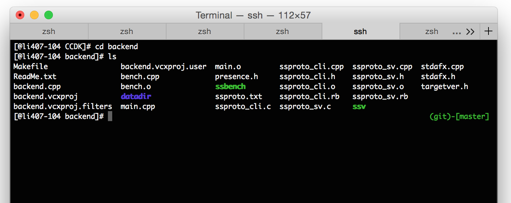

Navigate to the backend directory and launch the ssv program using the command below.

<pre>
bash$ ./ssv
</pre>

If the 'LD_LIBRARY_PATH' has not been set, the following error may occur indicating that hiredis cannot be found.

<pre>
./ssv: error while loading shared libraries: libhiredis.so.0.12: cannot open shared object file: No such file or directory
</pre>

If the ssv program is run without any parameters, the program will complete execution after displaying usage information (as shown below).
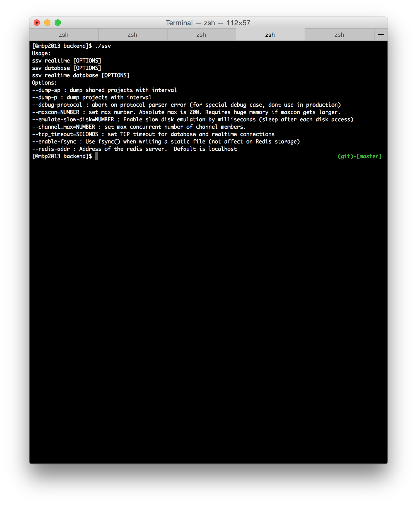

<B>Step 5 - Launching the Redis server</B>
The ssv program uses Redis instead of an SQL server for data storage.
Redis can be launched from any location with the following command.
<pre>
bash$ redis-server 
</pre>
When launched, Redis display its logo in ASCII art (as shown below).
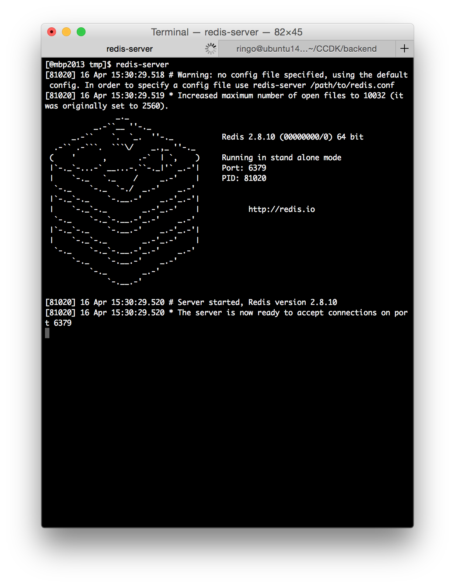

<B>Step 6 - Launching the backend server</B>
Navigate to the 'CCDK/backend' directory and run the following command:
<pre>
bash$ ./ssv realtime database 
</pre>
The backend server should launch in a similar fashion to that shown below. 
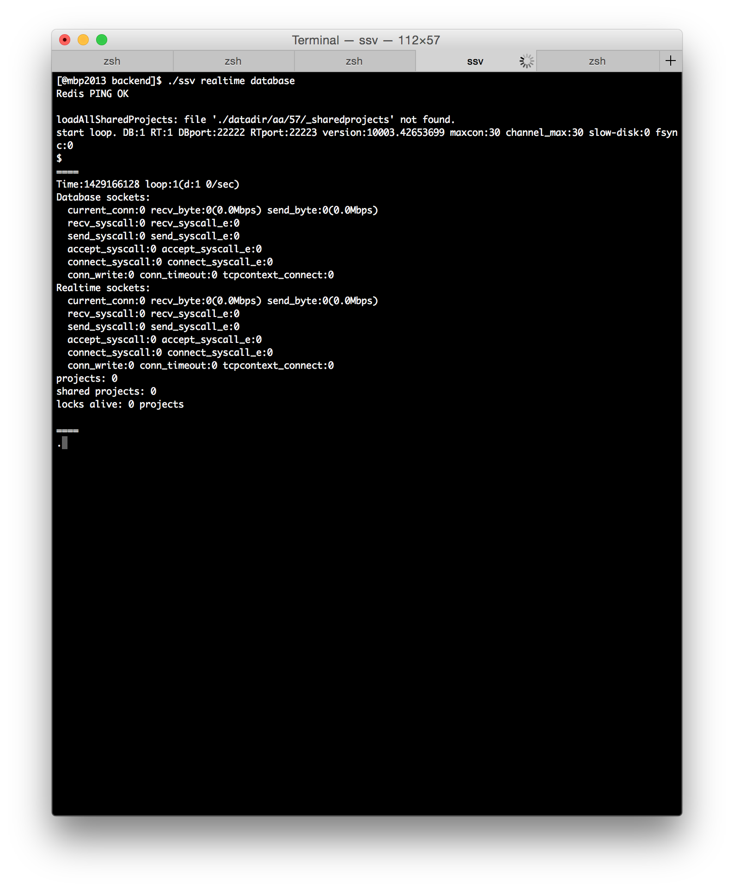
